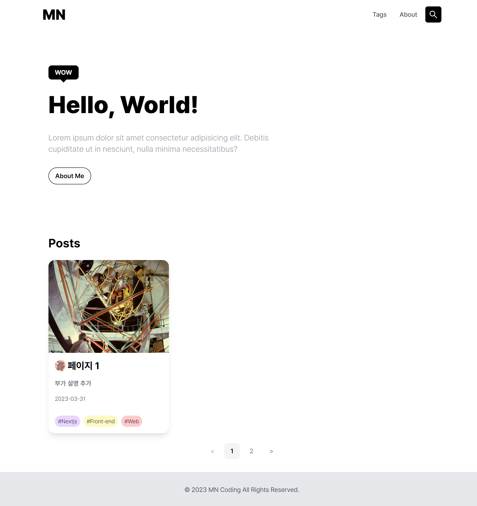

# Next.js와 Notion API로 만드는 블로그

## 🧩 데모
https://notion-blog-v2-dusky.vercel.app/

## 🖼️ 스크린샷

## 🛫 실행
> `const/const.ts` 파일에서 `ITEMS_PER_PAGE`를 조정하여 화면에 보여질 게시글 갯수 조정 가능(현재 1개)
> `env.sample`을 참고하여 `.env.local` 파일을 생성한 뒤 실행

## 🧱 기술 스택
- `TypeScript`
- `Next.js`
- `Tailwind CSS`
- `Notion API`
- `react-notion-x`
- [`swr`](https://swr.vercel.app/ko)
- [`lqip-modern`](https://github.com/transitive-bullshit/lqip-modern)
- `giscus`
- `pretendard`
- `react-icons`

## ✅ 구현 사항
- [x] Next.js@12로 만들어서 @13으로 마이그레이션 해보기(pages -> appDir)
- [x] 노션 API로 받아온 데이터 파싱해서 블로그 만들기
- [x] 미리보기 썸네일 이미지 빌드하기
- [x] 정적 사이트 빌드 및 ISR 적용하기
- [x] 상세 페이지 노션과 비슷한 레이아웃 디자인 만들기
- [x] 댓글 시스템 부착하기
- [x] 그외 태그, 검색 시스템 등등
- [x] 노션 API의 한계인 1초당 3번 호출 해결 -> 정적 사이트 빌드 + ISR 적용
- [x] 노션 API의 한계인 정적 파일의 만료 기한 해결 -> `Route handler`를 통해 정적 파일은 클라이언트에서 그때그때 불러오도록 변경
  - [x] ISR과 정적 파일 만료가 동시에 적용되면 Vercel에서 이미지 최적화를 비정상적으로 많이 호출하게 되어서 필요 이상의 요금이 나올 위험이 존재
